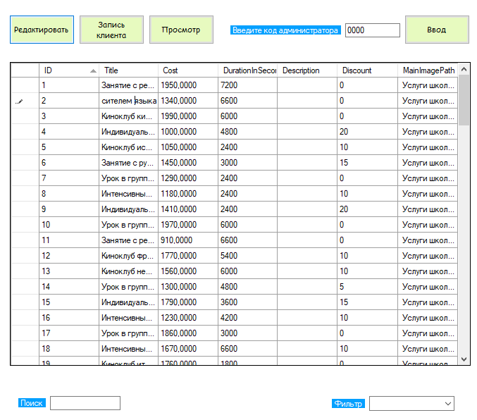
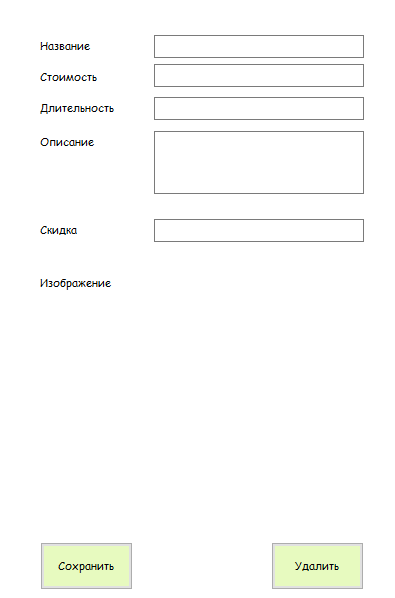
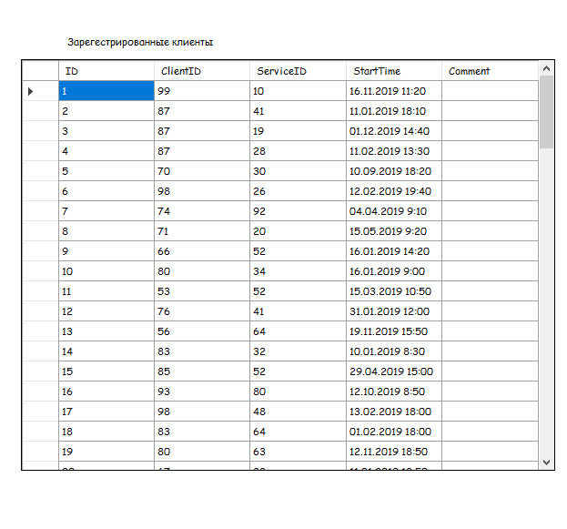
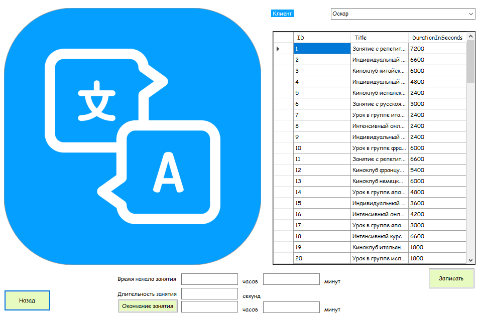

# Услуги школы иностранных языков Learn

Этот проект предоставляет систему управления услугами школы иностранных языков, включая управление списком услуг, запись клиентов на услуги и просмотр ближайших занятий

## Начало работы

Эти инструкции предоставят вам копию проекта и помогут запустить на вашем локальном компьютере для разработки и тестирования.

### Необходимые условия

Что нужно для установки программного обеспечения и как его установить

Перед началом установки убедитесь что у вас установлено следующее программное обеспечение:
*База данных Microsoft SQL MS
*Git

### Установка

1. Клонируйте репозиторий проекта на ваш компьютер:
	git clone https://github.com/Learn.git
2. Перейдите в папку проекта:
	cd Learn
3. Примените миграцию для создания структуры базы данных:
	Learn.cpp migrate
4. Запустите сервер:
	Learn.cpp runserver
### Пример использования
После запуска сервера администратор может:
*Добавлять/удалять/редактировать данные об услугах.

*Загружать изображения и описания для каждой услуги.

*Просматривать записи клиентов на услуги.

*Планировать расписание ближайших занятий.

## Авторы

* **Politunov Kirill** - *Initial work* - [Learn](https://github.com/Learn)

See also the list of [contributors](https://github.com/KirillPolitunov/Learn/contributors) who participated in this project.
